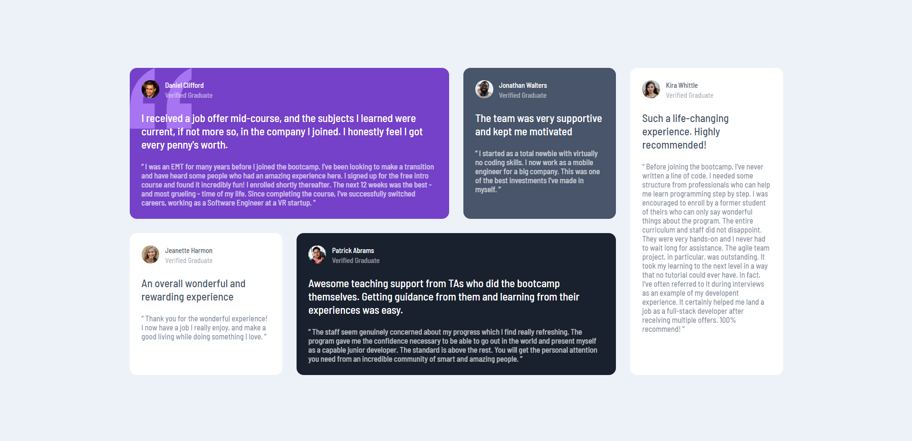
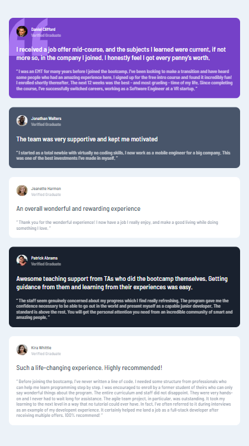

# Frontend Mentor - Testimonials grid section solution

This is a solution to the [Testimonials grid section challenge on Frontend Mentor](https://www.frontendmentor.io/challenges/testimonials-grid-section-Nnw6J7Un7). Frontend Mentor challenges help you improve your coding skills by building realistic projects.

## Table of contents

-   [Overview](#overview)
    -   [The challenge](#the-challenge)
    -   [Screenshot](#screenshot)
    -   [Links](#links)
-   [My process](#my-process)
    -   [Built with](#built-with)
    -   [What I learned](#what-i-learned)
-   [Author](#author)

## Overview

### The challenge

Users should be able to:

-   View the optimal layout for the site depending on their device's screen size

### Screenshot

|               Desktop Version               |               Mobile Version               |
| :-----------------------------------------: | :----------------------------------------: |
|  |  |

### Links

-   [Solution URL](https://github.com/ywsoliman/testimonials-grid-section)
-   [Live Site URL](https://ywsoliman.github.io/testimonials-grid-section/)

## My process

### Built with

-   HTML
-   CSS
    -   Flexbox
    -   CSS Grid

### What I learned

```css
main {
    max-width: 1100px;
    display: grid;
    grid-template-columns: repeat(12, 1fr);
    grid-template-rows: auto auto;
    grid-template-areas:
        "daniel daniel daniel daniel daniel daniel jonathan jonathan jonathan kira kira kira"
        "jeanette jeanette jeanette patrick patrick patrick patrick patrick patrick kira kira kira";
    gap: 24px 24px;
    margin: 24px;
}
```

## Author

-   Frontend Mentor - [@ywsoliman](https://www.frontendmentor.io/profile/ywsoliman)
-   Linkedin - [@ywsoliman](https://www.linkedin.com/in/ywsoliman/)
